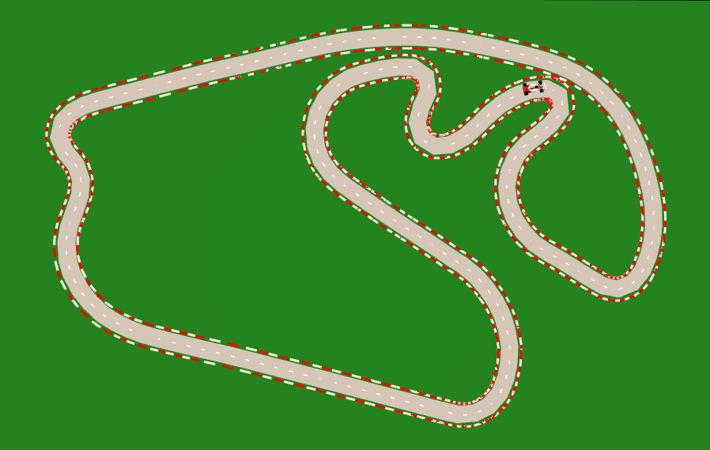
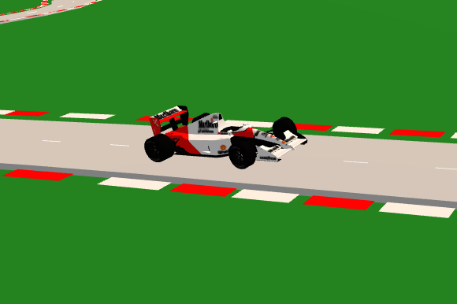

# Jogo de Fórmula 1 com Three.js

Este projeto implementa um jogo simples de Fórmula 1 utilizando a biblioteca [Three.js](https://threejs.org/) para renderização 3D no navegador. O jogo inclui uma pista carregada de um arquivo SVG, um carro 3D em movimento e elementos visuais como bordas, linha pontilhada central e gramado ao redor da pista.

## Estrutura do Projeto

```
.vscode/               # Configurações do VSCode (opcional)
cars/                 # Modelos 3D dos carros
  - f1_car.glb        # Modelo 3D do carro de Fórmula 1
node_modules/         # Dependências instaladas via npm
tracks/               # Arquivos SVG com os circuitos das pistas
  - Brazil.svg        # Exemplo de pista
index.html            # Arquivo principal do projeto
script.js             # Lógica do jogo e configurações da cena 3D
style.css             # Estilizações da página
package.json          # Configuração do projeto npm
README.md             # Documentação do projeto
```

## Recursos Utilizados

- **Three.js**: Para renderização e controle da cena 3D.
- **GLTFLoader**: Para carregar o modelo 3D do carro.
- **SVGLoader**: Para carregar o traçado da pista a partir de arquivos SVG.
- **OrbitControls**: Para navegação e controle da câmera.

## Funcionalidades

1. **Pista 3D**:
   - Gerada a partir de arquivos SVG presentes na pasta `tracks/`.
   - Possui bordas coloridas (vermelho e branco) e linha pontilhada central.
2. **Modelo 3D do carro**:
   - Carregado da pasta `cars/` e animado ao longo da pista.
3. **Cenário detalhado**:
   - Iluminação simulando o sol e luz ambiente.
   - Gramado dinâmico ao redor da pista.
4. **Controles da câmera**:
   - Movimentação livre usando o mouse.

## Como Executar o Projeto

### Requisitos

- [Node.js](https://nodejs.org/) instalado na máquina.
- Navegador moderno (recomendado: Google Chrome ou Mozilla Firefox).

### Passos para Execução

1. Clone ou baixe este repositório.
2. Instale as dependências do projeto:
   ```bash
   npm install
   ```
3. Inicie um servidor local para servir os arquivos. Por exemplo, use o pacote `http-server`:
   ```bash
   npx http-server
   ```
4. Acesse o jogo no navegador:
   ```
   http://localhost:8080
   ```

## Personalização

- **Adicionando novas pistas**:
  1. Insira arquivos SVG na pasta `tracks/`.
  2. Certifique-se de que o SVG segue o formato adequado para que o loader consiga processá-lo.

- **Substituindo o carro**:
  1. Substitua o arquivo `f1_car.glb` na pasta `cars/` por outro modelo GLB.
  2. Atualize o código, se necessário, para ajustar as escalas e a posição.

## Tecnologias Utilizadas

- HTML5, CSS3 e JavaScript
- Biblioteca Three.js para renderização 3D
- Modelos GLTF e arquivos SVG

## Autor

Projeto desenvolvido para fins de aprendizado e exploração da biblioteca Three.js. Sinta-se à vontade para contribuir e sugerir melhorias!

---

### Screenshots (Exemplo)

- **Visão Geral da Pista**
  
  

- **Carro em Movimento**
  
  

---

Aproveite o jogo e explore as possibilidades da renderização 3D com Three.js!
